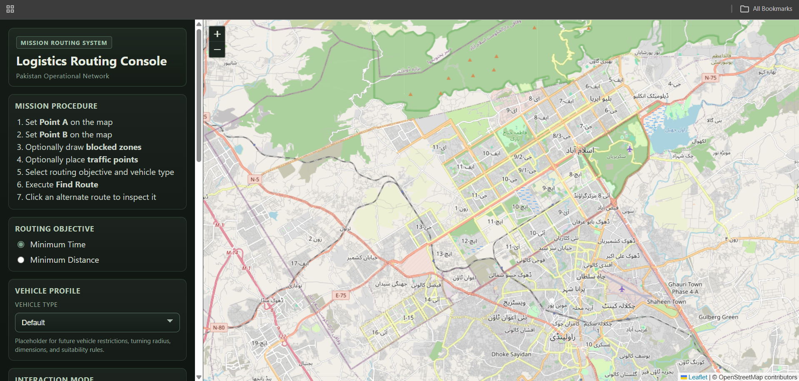

# Logistics Routing MVP with PostGIS, pgRouting, Flask, and Leaflet

This is a personal web mapping and GIS development project for full-stack geospatial application development.

The main idea of this project is to create a small logistics routing system where a user can select a start point and end point on a map, add blocked zones, add traffic points, and then calculate possible route alternatives. The project uses OpenStreetMap road data, PostGIS, pgRouting, a Flask backend API, and a Leaflet frontend.




## Project Overview

The application works like a simple routing console.

A user can:

- Select Point A and Point B on the map
- Choose routing mode:
  - minimum time
  - minimum distance
- Draw blocked polygon zones on the map
- Add traffic points on the map
- Request route alternatives
- View selected route distance, time, and number of steps
- Inspect alternative routes on an interactive Leaflet map

The backend processes the routing request using a road network stored in PostgreSQL/PostGIS and pgRouting. The frontend sends route requests to the Flask API and displays route results on the map.


## Main Features

### Interactive Web Map

The frontend is built with Leaflet. The map allows the user to place start and end points, draw blocked zones, add traffic points, and view routing results.

### Route Alternatives

The backend can return multiple route alternatives. The user can click route options in the side panel and inspect the selected route on the map.

### Distance and Time Routing

The system supports two routing objectives:

- shortest distance
- shortest travel time

These are handled using different cost fields in the pgRouting network.

### Blocked Zones

The user can draw polygon barriers on the map. These polygons are sent to the backend as GeoJSON.

The backend checks which road segments intersect the blocked polygons and avoids blocked parts of the network during route calculation.

### Traffic Points

The user can add traffic points on the map. These points are used as a simple way to simulate traffic delay in the routing calculation.

### Docker Setup

The project uses Docker Compose to run the main services:

- PostGIS / pgRouting database
- data builder container
- Flask backend
- Nginx frontend

This makes the project easier to run in a consistent environment.

## System Architecture

The project uses a simple full-stack architecture:

```text
User
 │
 │ interacts with map
 ▼
Leaflet Frontend
 │
 │ sends JSON route request
 ▼
Flask Backend API
 │
 │ runs routing logic and SQL queries
 ▼
PostgreSQL + PostGIS + pgRouting
 │
 │ stores road network and calculates routes
 ▼
Route GeoJSON returned to frontend
 │
 ▼
Route displayed on Leaflet map
```

## Technology Stack

| Part | Technology Used |
|---|---|
| Frontend | HTML, CSS, JavaScript |
| Web Map | Leaflet, Leaflet Draw |
| Backend | Python, Flask |
| API Format | JSON / GeoJSON |
| Database | PostgreSQL |
| Spatial Database | PostGIS |
| Routing Engine | pgRouting |
| OSM Import | osm2pgsql |
| Containerization | Docker, Docker Compose |
| Web Server | Nginx for frontend container |

## Folder Structure

```text
logistics-routing-mvp/
│
├── backend/
│   ├── app/
│   │   ├── routes/
│   │   │   └── routing.py
│   │   ├── services/
│   │   │   └── routing_service.py
│   │   ├── utils/
│   │   │   └── validators.py
│   │   ├── config.py
│   │   ├── db.py
│   │   └── main.py
│   ├── Dockerfile
│   └── requirements.txt
│
├── database/
│   ├── init/
│   │   └── 01_extensions.sql
│   └── build/
│       ├── 02_build_routing_network.sql
│       └── 03_build_costs_and_topology.sql
│
├── docker/
│   └── db/
│       └── Dockerfile
│
├── frontend/
│   ├── css/
│   │   └── styles.css
│   ├── js/
│   │   └── app.js
│   └── index.html
│
├── scripts/
│   └── setup_data.sh
│
├── data/
│   └── raw/
│       └── pakistan-latest.osm.pbf
│
├── docker-compose.yml
├── .env.example
├── .gitignore
└── README.md
```

## Backend API

The backend is built using Flask.

The main routing API is inside:

```text
backend/app/routes/routing.py
```

The backend has a simple health check endpoint and route endpoints.

Example simple route endpoint:

```text
GET /api/route/simple
```

Example main route endpoint:

```text
POST /api/route
```

The main POST route accepts:

```json
{
  "start": {
    "lat": 33.70,
    "lon": 73.10
  },
  "end": {
    "lat": 33.65,
    "lon": 73.05
  },
  "mode": "time",
  "blocked_polygons": [],
  "traffic_points": [],
  "k": 3
}
```

The API validates:

- start coordinate
- end coordinate
- routing mode
- blocked polygons
- traffic points
- number of route alternatives

The validation logic is stored in:

```text
backend/app/utils/validators.py
```

## Database Connection

The backend connects to PostgreSQL using environment variables.

The database connection is defined in:

```text
backend/app/db.py
```

The database settings are loaded from:

```text
backend/app/config.py
```

This keeps the project cleaner because database credentials are not hardcoded directly into the backend code.

## SQL and Spatial Database Details

This project uses SQL heavily to prepare the road network and make it usable for routing.

The SQL workflow is mainly stored in:

```text
database/init/01_extensions.sql
database/build/02_build_routing_network.sql
database/build/03_build_costs_and_topology.sql
```

### 1. Enabling Required Extensions

The first SQL file enables the required PostgreSQL extensions:

```sql
CREATE EXTENSION IF NOT EXISTS postgis;
CREATE EXTENSION IF NOT EXISTS pgrouting;
CREATE EXTENSION IF NOT EXISTS hstore;
```

These are important because:

- `postgis` adds spatial data types and spatial functions
- `pgrouting` adds network routing functions
- `hstore` helps with OpenStreetMap tag storage

### 2. Importing OpenStreetMap Data

The project expects an OpenStreetMap `.pbf` file inside:

```text
data/raw/
```

For this project, the expected file name is:

```text
pakistan-latest.osm.pbf
```

The import is handled in:

```text
scripts/setup_data.sh
```

The script uses `osm2pgsql` to import the OSM file into PostgreSQL.

After import, OSM tables such as `planet_osm_line` are available in the database.

### 3. Building the Routing Road Network

The SQL file:

```text
database/build/02_build_routing_network.sql
```

creates a cleaned routing road table from OSM line data.

It filters road features where the `highway` tag is not null and keeps major road classes such as:

```sql
'motorway',
'trunk',
'primary',
'secondary',
'motorway_link',
'trunk_link',
'primary_link',
'secondary_link'
```

The reason for filtering is to keep the routing network smaller and more focused on logistics-style movement rather than every small street or path.

The SQL creates a raw road table first:

```sql
CREATE TABLE routing_roads_raw AS
SELECT
    ROW_NUMBER() OVER () AS raw_id,
    osm_id,
    name,
    highway,
    oneway,
    bridge,
    tunnel,
    COALESCE(layer, '0') AS layer,
    way
FROM planet_osm_line
WHERE highway IS NOT NULL;
```

It also creates a `level_key` using layer, bridge, and tunnel information. This is useful because roads at different levels should not always be treated as intersecting just because they cross in 2D space.

For example:

- a bridge crossing over a road
- a tunnel going under a road
- roads on different layers

This matters in routing because two roads that visually cross are not always connected.

### 4. Noding the Road Network

The routing network needs road segments that are properly split at valid intersections.

The SQL uses PostGIS functions such as:

```sql
ST_Collect()
ST_UnaryUnion()
ST_Node()
ST_Dump()
```

These functions help combine road geometries, node them, and split them into smaller LineString segments.

A simplified version of the logic is:

```sql
WITH noded AS (
    SELECT
        level_key,
        (ST_Dump(ST_Node(ST_UnaryUnion(ST_Collect(way))))).geom AS geom
    FROM routing_roads_raw
    GROUP BY level_key
)
```

This creates line segments that can later be used as a routable network.

### 5. Creating the Final Routing Table

The processed road segments are stored in:

```text
routing_roads
```

This table stores road geometry and attributes needed for routing, such as:

- road ID
- OSM ID
- road name
- highway type
- one-way information
- bridge/tunnel/layer information
- geometry

### 6. Calculating Distance and Travel Time Costs

The SQL file:

```text
database/build/03_build_costs_and_topology.sql
```

adds routing cost fields:

```sql
source
target
length_m
speed_kmh
travel_time_sec
cost_distance
cost_time
reverse_cost_distance
reverse_cost_time
```

The road length is calculated using:

```sql
UPDATE routing_roads
SET length_m = ST_Length(way);
```

A simple speed value is assigned based on road class:

```sql
UPDATE routing_roads
SET speed_kmh = CASE
    WHEN highway = 'motorway' THEN 90
    WHEN highway = 'trunk' THEN 80
    WHEN highway = 'primary' THEN 60
    WHEN highway = 'secondary' THEN 50
    WHEN highway = 'motorway_link' THEN 40
    WHEN highway = 'trunk_link' THEN 35
    WHEN highway = 'primary_link' THEN 30
    WHEN highway = 'secondary_link' THEN 25
    ELSE 30
END;
```

Then travel time is calculated from length and speed:

```sql
UPDATE routing_roads
SET travel_time_sec = CASE
    WHEN speed_kmh > 0 THEN length_m / (speed_kmh * 1000.0 / 3600.0)
    ELSE NULL
END;
```

This gives the estimated time in seconds.

### 7. Handling One-Way Roads

The routing table also stores forward and reverse costs.

For one-way roads, one direction is blocked by assigning a very high cost:

```sql
1000000000
```

For example:

```sql
cost_distance = CASE
    WHEN oneway IN ('-1', 'reverse') THEN 1000000000
    ELSE length_m
END
```

This allows pgRouting to avoid travelling in the wrong direction on one-way roads.

### 8. Creating pgRouting Topology

The SQL uses:

```sql
pgr_createTopology()
```

to create source and target nodes for each road segment:

```sql
SELECT pgr_createTopology(
    'routing_roads',
    0.001,
    'way',
    'id'
);
```

This creates the graph structure required by pgRouting.

After this step, the routing network has:

- edges
- source nodes
- target nodes
- cost values
- reverse cost values

### 9. Indexing and Performance

The SQL also creates indexes to improve query performance:

```sql
CREATE INDEX idx_routing_roads_way
ON routing_roads
USING GIST (way);
```

```sql
CREATE INDEX IF NOT EXISTS idx_routing_roads_source
ON routing_roads (source);
```

```sql
CREATE INDEX IF NOT EXISTS idx_routing_roads_target
ON routing_roads (target);
```

The GiST index helps with spatial queries, while source and target indexes help with network routing queries.

## Routing Logic

The routing logic is mainly handled in:

```text
backend/app/services/routing_service.py
```

The backend performs several important tasks:

1. Finds the nearest road edge to the selected start point
2. Finds the nearest road edge to the selected end point
3. Handles blocked polygon intersections
4. Splits road segments when needed
5. Applies traffic delay penalties
6. Runs routing using distance or time cost
7. Returns route geometry as GeoJSON

## Blocked Zone Logic

Blocked zones are drawn by the user on the frontend as polygons.

The polygons are sent to the backend in GeoJSON format.

The backend then checks which road segments intersect the blocked polygon using PostGIS functions such as:

```sql
ST_Intersects()
ST_Intersection()
ST_LineLocatePoint()
```

The idea is that if a road segment passes through a blocked zone, that part of the road should not be used in the route.

This was one of the more challenging parts of the project because a blocked zone may only cover part of a road segment, not the whole segment.

## Traffic Point Logic

Traffic points are used as a simple traffic simulation.

The current version applies a basic traffic delay penalty when traffic points are included in the routing request.

This is not a real-time traffic system yet. It is more of a prototype to show how traffic-type inputs can affect route cost.

## Frontend Details

The frontend is stored in:

```text
frontend/
```

Main files:

```text
frontend/index.html
frontend/css/styles.css
frontend/js/app.js
```

The interface includes:

- sidebar control panel
- mission procedure section
- route objective selection
- vehicle profile dropdown
- point placement mode
- blocked zone drawing mode
- traffic point mode
- route alternatives list
- selected route summary
- main Leaflet map

The frontend sends route requests to:

```javascript
const API_BASE_URL = "http://localhost:5000/api";
```

The UI is designed with a logistics / routing console style. I wanted it to feel more like an operational routing dashboard instead of a basic map page.

## How to Run Locally

### 1. Clone the Repository

```bash
git clone https://github.com/YOUR-USERNAME/logistics-routing-mvp.git
cd logistics-routing-mvp
```

### 2. Create `.env` File

Copy the example environment file:

```bash
cp .env.example .env
```

On Windows PowerShell:

```powershell
Copy-Item ".env.example" ".env"
```

Example `.env` values:

```env
POSTGRES_DB=routing_db
POSTGRES_USER=postgres
POSTGRES_PASSWORD=postgres

DB_HOST=db
DB_PORT=5432
DB_NAME=routing_db
DB_USER=postgres
DB_PASSWORD=postgres

BACKEND_PORT=5000
FRONTEND_PORT=8080
```

### 3. Add OpenStreetMap PBF Data

Download an OpenStreetMap `.pbf` file and place it here:

```text
data/raw/
```

For the current setup, the expected file name is:

```text
pakistan-latest.osm.pbf
```

The file is not included in this repository because OSM `.pbf` files are large.

### 4. Start Docker Containers

Run:

```bash
docker compose up --build
```

This will:

1. Start the PostGIS / pgRouting database
2. Import the OSM `.pbf` file
3. Build the routing network
4. Start the Flask backend
5. Start the Leaflet frontend

### 5. Open the Frontend

Open the frontend in your browser:

```text
http://localhost:8080
```

Backend API health check:

```text
http://localhost:5000/health
```

Routing API health check:

```text
http://localhost:5000/api/health
```

## Data Requirement

This project requires OpenStreetMap road data in `.osm.pbf` format.

The current setup expects:

```text
data/raw/pakistan-latest.osm.pbf
```

The `.pbf` file is ignored by Git because it can be large.

You can download OSM extracts from providers such as Geofabrik and place the file in the required folder.

## Current Limitations

This is still an MVP, so there are limitations.

- The road network currently focuses on selected major road classes.
- Traffic points are only a simple delay simulation, not live traffic.
- Vehicle profiles are currently placeholders for future vehicle-specific restrictions.
- The speed values are simple assumptions based on road class.
- The frontend is designed for local use and is not yet fully production deployed.
- The route optimization is based on the available network and current cost model.
- Large OSM datasets can take time to import and process.
- Error handling can still be improved.

## Future Improvements

In future versions, I want to improve this project by adding:

- Better vehicle profile logic
- Vehicle specific road restrictions
- More advanced traffic modelling
- Route export as GeoJSON
- Route report generation
- A cleaner deployment workflow
- More advanced frontend design
- Support for different countries or regions
- More complete testing for backend and routing functions

I also want to integrate LLMs into future versions of this project. The idea would be to allow a user to describe routing needs in natural language, such as avoiding certain areas, prioritizing safer roads, selecting vehicle type, or explaining route choices. An LLM could help translate user instructions into routing parameters, summarize route alternatives, and support smarter route optimization decisions.

## Skills Demonstrated

This project demonstrates:

- Full-stack GIS application development
- Web mapping with Leaflet
- Backend API development with Flask
- Spatial database work with PostGIS
- Network analysis with pgRouting
- SQL-based geospatial data processing
- OpenStreetMap data preparation
- Docker-based project setup
- GeoJSON handling
- Interactive map UI design
- Routing logic and cost modelling
- Spatial problem solving

## Notes

This is a personal learning project and MVP. The project is still being improved, but it already shows the full workflow of taking raw OpenStreetMap data, building a routable spatial network, creating a backend routing API, and displaying route results in an interactive web map.